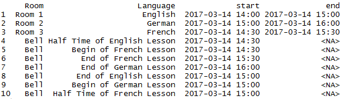
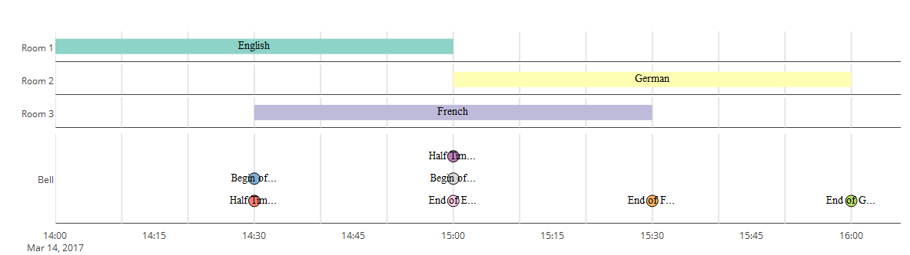

# vistime
####an R package for pretty timeline creation

Create _fully interactive_ timelines or Gantt charts using `plotly.js`. The charts can be included in Shiny apps and manipulated via `plotly_build()`.

Given a data frame containing event names and dates (can be `String`, `Date` or `POSIXct` in standard notation) and optionally groups, end dates for ranges and/or colors, it creates a charming diagram of the given dates and events. It distinguishes between single events (having StartDate == EndDate) and ranges (given EndDate). Color column name can be handed over with the `color`-argument, if none are given, they are chosen from `RColorBrewer`.

**Feedback welcome:** shosaco_nospam@hotmail.com  


### Installation

To install the package from CRAN:

    install.packages("vistime")

To install the development version (most recent fixes and improvements, but not released on CRAN yet), run the following code in an R console:
```{r}
install.package("devtools")
devtools::install_github("shosaco/vistime")
```
    

### Use

To create a timeline, your data needs to have a name for the **event** and a starting date **start**. If your column names differ, just hand them over as arguments in `events="myEventNames"` or `start="myStartDates"` respectively. For data ranges, you need to provide the ending date for each range (otherwise they are assumed to be single events). You can provide a `colors` column if you have colouring preferences and if you provide a `group` column (names group or by parameter `group="MyGroups"`), the chart is grouped into the given group levels.

    library(vistime)
    data(school)
    school
    vistime(school, events="Language", groups="Room")




 
  


