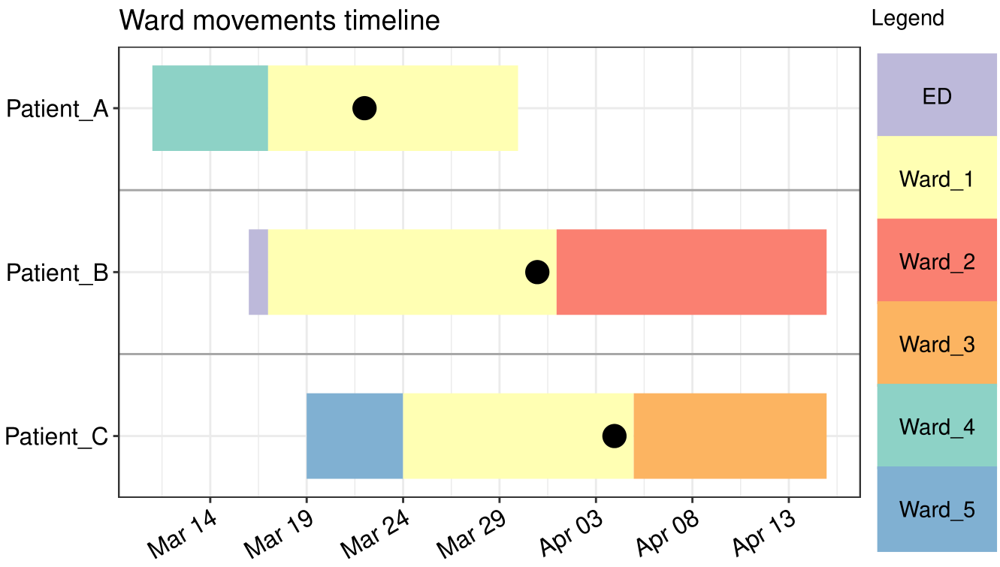

[](https://www.buymeacoffee.com/shosaco)
[](https://cran.r-project.org/package=vistime)
[](https://github.com/shosaco/vistime/actions)
[](https://www.r-pkg.org/pkg/vistime)
[](https://www.r-pkg.org/pkg/vistime)
[](https://www.r-pkg.org/pkg/vistime)
[](https://codecov.io/github/shosaco/vistime)
[](https://github.com/shosaco/vistime)

vistime - Pretty Timelines in R
=========

A library for creating time-based charts, like Gantt or timelines. Possible outputs include `ggplot`s, `plotly` graphs, `Highchart`s or `data.frame`s. Results can be used in the RStudio viewer pane, in R Markdown documents or in Shiny apps. In the interactive outputs created by `vistime()` and `hc_vistime()` you can interact with the plot using mouse hover or zoom. Timelines and their components can afterwards be manipulated using `ggplot::theme()`, `plotly_build` or `hc_*`functions (for `gg_vistime`, `vistime` or `hc_vistime`, respectively). When choosing the `data.frame` output, you can use your own plotting engine for visualizing the graph.

If you find vistime useful, please consider supporting its development: <a href="https://www.buymeacoffee.com/shosaco" target="_blank"></a>

**Feedback welcome:** [sa.ra.online@posteo.de](mailto:sa.ra.online@posteo.de)

## Table of Contents

1. [Main functionality](#1-main-functionality)
2. [Installation](#2-installation)
3. [Real-life example](#3-real-life-example)
3. [Usage and documentation](#4-usage-and-documentation)

## 1. Main functionality

This package `vistime` provides three main functions: 

### 1) `vistime()` to produce interactive `Plotly` charts:

```{r}
timeline_data <- data.frame(event = c("Event 1", "Event 2"),
                            start = c("2020-06-06", "2020-10-01"), 
                            end = c("2020-10-01", "2020-12-31"),
                            group = "My Events")
                            
vistime(timeline_data)
```


### 2) `hc_vistime()` to produce interactive `Highcharts` charts:

```{r}
timeline_data <- data.frame(event = c("Event 1", "Event 2"),
                            start = c("2020-06-06", "2020-10-01"), 
                            end = c("2020-10-01", "2020-12-31"),
                            group = "My Events")
                            
hc_vistime(timeline_data)
```


This is facilitated by the `highcharter` package, so, this package needs to be installed before attempting to produce any `hc_vistime()` output.

### 3) `gg_vistime()` to produce static `ggplot2` output:

```{r}
timeline_data <- data.frame(event = c("Event 1", "Event 2"),
                            start = c("2020-06-06", "2020-10-01"), 
                            end = c("2020-10-01", "2020-12-31"),
                            group = "My Events")
                            
gg_vistime(timeline_data)
```


### 4)  `vistime_data()`, for pure `data.frame` output that you can use with the plotting engine of your choice: 

```{r}
timeline_data <- data.frame(event = c("Event 1", "Event 2"),
                            start = c("2020-06-06", "2020-10-01"), 
                            end = c("2020-10-01", "2020-12-31"),
                            group = "My Events")
                            
vistime_data(timeline_data)

#>     event      start        end     group                                      tooltip      col subplot   y
#> 1 Event 1 2020-06-06 2020-10-01 My Events  from <b>2020-06-06</b> to <b>2020-10-01</b>  #8DD3C7       1   1
#> 2 Event 2 2020-10-01 2020-12-31 My Events  from <b>2020-10-01</b> to <b>2020-12-31</b>  #FFFFB3       1   1
```

You want to use this for the intelligent y-axis assignment depending on overlapping of events (this can be disabled with `optimize_y = FALSE`).

## 2. Installation

To install the package from CRAN, type the following in your R console:
```{r}
install.packages("vistime")
```
<!--
To install the development version containing most recent fixes and improvements, but not released on CRAN yet, see NEWS.md), run the following code in an R console:

```{r}
if (!require("remotes")) install.packages("remotes")
remotes::install_github("shosaco/vistime")
```

-->

## 3. Real-life example

During COVID-19 2020, [wlhamilton](https://github.com/wlhamilton) used `gg_vistime()` for visualising patient ward movements as timelines in order to investigate possible hospital acquired infections. See [his github](https://github.com/wlhamilton/Patient-ward-movement-timelines) for the code.



## 4. Usage and documentation

There is a vignette for each of the three functions of the package where they are explained in detail:

- `vistime()` for interactive **Plotly** output: [Link to manual](https://CRAN.R-project.org/package=vistime/vignettes/vistime-vignette.html)
- `gg_vistime()` for static **ggplot2** output: [Link to manual](https://CRAN.R-project.org/package=vistime/vignettes/gg_vistime-vignette.html)
- `hc_vistime()` for interactive **Highcharts** output: [Link to manual](https://CRAN.R-project.org/package=vistime/vignettes/hc_vistime-vignette.html)

