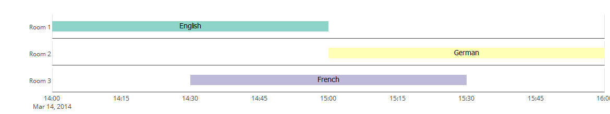
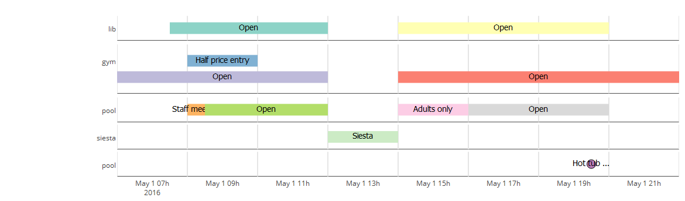

# vistime
an R package for pretty timeline creation

`vistime` is the first R package to create _fully interactive_ timelines/Gantt charts using Plotly.js. The charts can be included in Shiny apps and manipulated via `plotly_build()`.

Given a data frame containing Event Names and Dates (can be `String`, `Date` or `POSIXct` in standard notation) and optionally Groups, EndDates for ranges and colors, it creates a charming diagram of the given Dates and Events. It distinguishes between single events (having StartDate == EndDate) and ranges (given EndDate). Colors can be handed over as the `color`-argument, if none are given, they are chosen from `RColorBrewer`.

**Feedback welcome:** shosaco_nospam@hotmail.com  

******
## example 1:
```{r}
dat <- data.frame(Room = c("Room 1", "Room 2", "Room 3"),
                  Language = c("English", "German", "French"),
                  start = c("2017-03-14 14:00"," 2017-03-14 15:00", "2017-03-14 14:30"),
                  end = c("2017-03-14 15:00", "2017-03-14 16:00", "2017-03-14 15:30"))
vistime(dat, events="Language", groups="Room")
```

 
   
## example 2:
```{r}
dataGroups <- data.frame(
  content = c("Open", "Open", "Open", "Open", "Half price entry", "Staff meeting", "Open", "Adults only", "Open", "Hot tub closes"),
  start = c("2017-05-01 07:30:00", "2017-05-01 14:00:00", "2017-05-01 06:00:00", "2017-05-01 14:00:00", "2017-05-01 08:00:00",
            "2017-05-01 08:00:00", "2017-05-01 08:30:00", "2017-05-01 14:00:00","2017-05-01 16:00:00", "2017-05-01 19:30:00"),
  end   = c("2017-05-01 12:00:00", "2017-05-01 20:00:00", "2017-05-01 12:00:00", "2017-05-01 22:00:00", "2017-05-01 10:00:00",
            "2017-05-01 08:30:00", "2017-05-01 12:00:00", "2017-05-01 16:00:00", "2017-05-01 20:00:00", NA),
  group = c(rep("Tennis Court", 2), rep("Billard", 3), rep("Pool", 5)))

vistime(dataGroups, events="content")
```



