[](https://www.buymeacoffee.com/shosaco)
[](https://cran.r-project.org/package=vistime)
[](https://github.com/shosaco/vistime/blob/dev/NEWS.md)
[](https://www.r-pkg.org/pkg/vistime)
[](https://travis-ci.com/shosaco/vistime)
[](https://codecov.io/github/shosaco/vistime) 

vistime - Pretty Timelines
=========

A library for creating time-based charts, like Gantt or timelines. Possible outputs include `ggplot`s, `plotly` graphs or `data.frame`s. Results can be used in the RStudio viewer pane, in R Markdown documents or in Shiny apps. In the interactive `plotly` output, you can hover the mouse pointer over a point or task to show details or drag a rectangle to zoom in. Timelines and their components can afterwards be manipulated using `ggplot::theme()` or `plotly_build`, which transforms the plot into a mutable list. When choosing the `data.frame` output, you can use your own plotting engine for visualizing the graph.

If you find vistime useful, please consider supporting its development: <a href="https://www.buymeacoffee.com/shosaco" target="_blank"></a>

**Feedback welcome:** [sa.ra.online@posteo.de](mailto:sa.ra.online@posteo.de)

## Table of Contents

1. [Main functionality](#1-main-functionality)
2. [Installation](#2-installation)
3. [Usage](#3-usage-and-default-arguments)
4. [Arguments](#4-arguments)
5. [Value](#5-value)
6. [Examples](#6-examples)
   * [Ex. 1: Presidents](#ex-1-presidents)
   * [Ex. 2: Project Planning](#ex-2-project-planning)
7. [Exporting](#7-export-of-vistime-as-pdf-or-png)
8. [Usage in Shiny apps](#8-usage-in-shiny-apps)
9. [Customization](#9-customization)
   * [Using `ggplot2::theme()` for `gg_vistime` charts](#using-ggplot2theme-for-gg_vistime-charts)
   * [Using `plotly::plotly_build()` for `vistime` charts](#using-plotlyplotly_build-for-vistime-charts)
      * [Changing x-axis tick font size](#changing-x-axis-tick-font-size)
      * [Changing y-axis tick font size](#changing-y-axis-tick-font-size)
      * [Changing events font size](#changing-events-font-size)
      * [Changing marker size](#changing-marker-size)

## 1. Main functionality

This package `vistime` provides three main functions: 

### 1) `vistime()` to produce interactive `Plotly` charts:

```{r}
timeline_data <- data.frame(event=c("Event 1", "Event 2"), start = c("2020-06-06", "2020-10-01"), end = c("2020-10-01", "2020-12-31"), group = "My Events")
vistime(timeline_data)
```
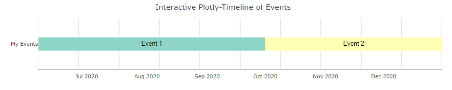

### 2) `gg_vistime()` to produce static `ggplot` output:

```{r}
timeline_data <- data.frame(event=c("Event 1", "Event 2"), start = c("2020-06-06", "2020-10-01"), end = c("2020-10-01", "2020-12-31"), group = "My Events")
gg_vistime(timeline_data)
```
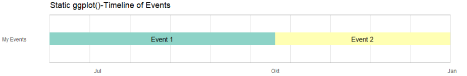

### 3)  `vistime_data()`, for pure `data.frame` output that you can use with the plotting engine of your choice: 

```{r}
timeline_data <- data.frame(event=c("Event 1", "Event 2"), start = c("2020-06-06", "2020-10-01"), end = c("2020-10-01", "2020-12-31"), group = "My Events")
vistime_data(timeline_data)

#>     event      start        end     group                                      tooltip      col subplot   y
#> 1 Event 1 2020-06-06 2020-10-01 My Events  from <b>2020-06-06</b> to <b>2020-10-01</b>  #8DD3C7       1   1
#> 2 Event 2 2020-10-01 2020-12-31 My Events  from <b>2020-10-01</b> to <b>2020-12-31</b>  #FFFFB3       1   1
```

You want to use this for the intelligent y-axis assignment depending on overlapping of events (this can be disabled with `optimize_y = FALSE`).

## 2. Installation

To install the package from CRAN (v1.0.0), type the following in your R console:
```{r}
install.packages("vistime")
```

To install the development version containing most recent fixes and improvements, but not released on CRAN yet, see NEWS.md), run the following code in an R console:

```{r}
if(!require("devtools")) install.packages("devtools")
devtools::install_github("shosaco/vistime")
```


## 3. Usage and default arguments

The simplest way to create a timeline is by providing a data frame with `event` and `start` columns. If your columns are named otherwise, you need to tell the function. You can also tweak the y positions, linewidth, title, label visibility and number of lines in the background.

```{r}
vistime(data, col.event = "event", col.start = "start", col.end = "end", col.group = "group", col.color = "color", 
              col.fontcolor = "fontcolor", col.tooltip = "tooltip", optimize_y = TRUE, linewidth = NULL, 
              title = NULL, show_labels = TRUE, background_lines = NULL)

gg_vistime(data, col.event = "event", col.start = "start", col.end = "end", col.groups = "group", col.color = "color", 
           col.fontcolor = "fontcolor", optimize_y = TRUE, linewidth = NULL, 
           title = NULL, show_labels = TRUE, background_lines = NULL)

vistime_data(data, col.event = "event", col.start = "start", col.end = "end", col.groups = "group", col.colors = "color", 
             col.fontcolor = "fontcolor", col.tooltip = "tooltip", optimize_y = TRUE)
```

## 4. Arguments

parameter | optional? | data type | explanation 
--------- |----------- | -------- | ----------- 
data | mandatory | data.frame | data.frame that contains the data to be visualized
col.event | optional | character | the column name in data that contains event names. Default: *event*
col.start | optional | character | the column name in data that contains start dates. Default: *start*
col.end | optional | character | the column name in data that contains end dates. Default: *end*
col.group | optional | character | the column name in data to be used for grouping. Default: *group*
col.color | optional | character | the column name in data that contains colors for events. Default: *color*, if not present, colors are chosen via RColorBrewer.
col.fontcolor | optional | character | the column name in data that contains the font color for event labels. Default: *fontcolor*, if not present, color will be black.
col.tooltip | optional | character | the column name in data that contains the mouseover tooltips for the events. Default: *tooltip*, if not present, then tooltips are build from event name and date. [Basic HTML](https://help.plot.ly/adding-HTML-and-links-to-charts/#step-2-the-essentials) is allowed.
optimize_y | optional | logical | distribute events on y-axis by smart heuristic (default) or use order of input data.
linewidth | optional | numeric | override the calculated linewidth for events. Default: heuristic value.
title | optional | character | the title to be shown on top of the timeline. Default: empty.
show_labels | optional | logical | choose whether or not event labels shall be visible. Default: `TRUE`.
background_lines | optional | integer | the number of vertical lines to draw in the background to demonstrate structure. Default: 10.

## 5. Value

`vistime` returns an object of class `plotly` and `htmlwidget`, `gg_vistime` returns an object of class `gg` and `ggplot` and `vistime_data` returns an object of class `data.frame`.

## 6. Examples  

### Ex. 1: Presidents
```{r}
pres <- data.frame(Position = rep(c("President", "Vice"), each = 3),
                   Name = c("Washington", rep(c("Adams", "Jefferson"), 2), "Burr"),
                   start = c("1789-03-29", "1797-02-03", "1801-02-03"),
                   end = c("1797-02-03", "1801-02-03", "1809-02-03"),
                   color = c('#cbb69d', '#603913', '#c69c6e'),
                   fontcolor = c("black", "white", "black"))
                  
vistime(pres, col.event = "Position", col.group = "Name", title = "Presidents of the USA")
```
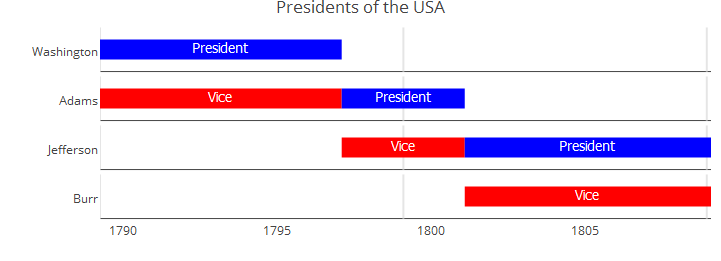

### Ex. 2: Project Planning
```{r}
data <- read.csv(text="event,group,start,end,color
                       Phase 1,Project,2016-12-22,2016-12-23,#c8e6c9
                       Phase 2,Project,2016-12-23,2016-12-29,#a5d6a7
                       Phase 3,Project,2016-12-29,2017-01-06,#fb8c00
                       Phase 4,Project,2017-01-06,2017-02-02,#DD4B39
                       Room 334,Team 1,2016-12-22,2016-12-28,#DEEBF7
                       Room 335,Team 1,2016-12-28,2017-01-05,#C6DBEF
                       Room 335,Team 1,2017-01-05,2017-01-23,#9ECAE1
                       Group 1,Team 2,2016-12-22,2016-12-28,#E5F5E0
                       Group 2,Team 2,2016-12-28,2017-01-23,#C7E9C0
                       3-200,category 1,2016-12-25,2016-12-25,#1565c0
                       3-330,category 1,2016-12-25,2016-12-25,#1565c0
                       3-223,category 1,2016-12-28,2016-12-28,#1565c0
                       3-225,category 1,2016-12-28,2016-12-28,#1565c0
                       3-226,category 1,2016-12-28,2016-12-28,#1565c0
                       3-226,category 1,2017-01-19,2017-01-19,#1565c0
                       3-330,category 1,2017-01-19,2017-01-19,#1565c0
                       1-217.0,category 2,2016-12-27,2016-12-27,#90caf9
                       4-399.7,moon rising,2017-01-13,2017-01-13,#f44336
                       8-831.0,sundowner drink,2017-01-17,2017-01-17,#8d6e63
                       9-984.1,birthday party,2016-12-22,2016-12-22,#90a4ae
                       F01.9,Meetings,2016-12-26,2016-12-26,#e8a735
                       Z71,Meetings,2017-01-12,2017-01-12,#e8a735
                       B95.7,Meetings,2017-01-15,2017-01-15,#e8a735
                       T82.7,Meetings,2017-01-15,2017-01-15,#e8a735")
                           
vistime(data)
```

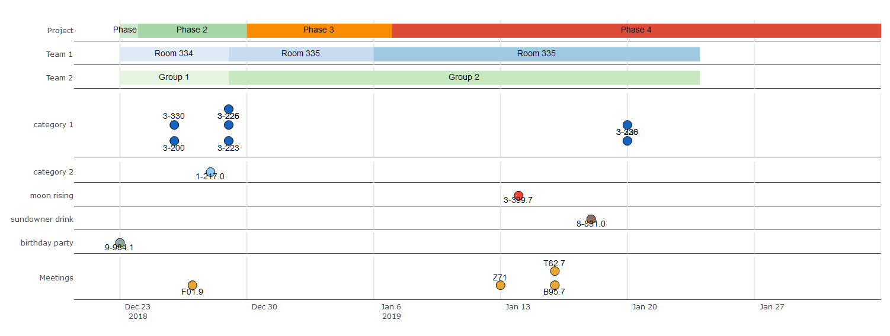


### Ex. 3: Gantt Charts

The argument `optimize_y` can be used to change the look of the timeline. `TRUE` (the default) will find a nice heuristic to save `y`-space, distributing the events:

```{r}
data <- read.csv(text="event,start,end
                       Phase 1,2020-12-15,2020-12-24
                       Phase 2,2020-12-23,2020-12-29
                       Phase 3,2020-12-28,2021-01-06
                       Phase 4,2021-01-06,2021-02-02")
        
vistime(data, optimize_y = TRUE)
```

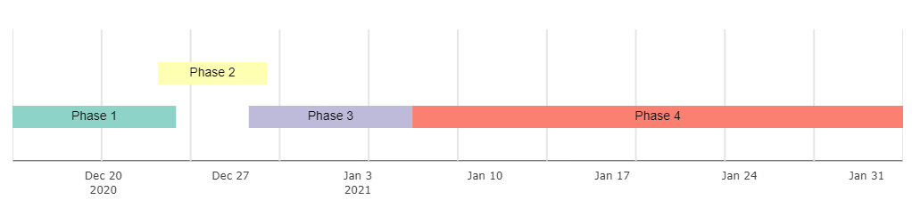


`FALSE` will plot events as-is, not saving any space:

```{r}
vistime(data, optimize_y = FALSE)
```

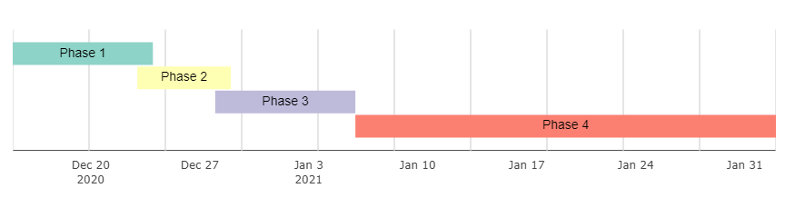


## 7. Export of vistime as PDF or PNG

Once created, you can use `plotly::export()` for saving your vistime chart (the plotly version) as PDF, PNG or JPEG:

```{r
# webshot::install_phantomjs()
chart <- vistime(pres, events="Position")
plotly::export(chart, file = "presidents.pdf")
```

Note that export requires the `webshot` package and additional arguments like width or height can be used (`?webshot` for the details). You can also download the plot as PNG by using the toolbar on the upper right side of the generated plot.

## 8. Usage in Shiny apps

The result of any call to `vistime(...)` is a `Plotly` object, so you can use `plotlyOutput()` in the UI and `renderPlotly()` in the server of your [Shiny app](https://shiny.rstudio.com/) to display your chart. The same goes for `gg_vistime(...)`, `plotOutput()` and `renderPlot()`:

```{r}
library(shiny)
library(plotly)
library(vistime)

pres <- data.frame(Position = rep(c("President", "Vice"), each = 3),
                   Name = c("Washington", rep(c("Adams", "Jefferson"), 2), "Burr"),
                   start = c("1789-03-29", "1797-02-03", "1801-02-03"),
                   end = c("1797-02-03", "1801-02-03", "1809-02-03"),
                   color = c('#cbb69d', '#603913', '#c69c6e'),
                   fontcolor = c("black", "white", "black"))

shinyApp(
  ui = plotlyOutput("myVistime"),
  server = function(input, output) {
    output$myVistime <- renderPlotly({
      vistime(pres, col.event = "Position", col.group = "Name")
    })
  }
)
```

## 9. Customization

### Using `ggplot2::theme()` for `gg_vistime` charts

Since every `gg_vistime` output is a `ggplot` object, you can customize and override literally everything:

```{r}
data <- read.csv(text="event,start,end
                       Phase 1,2020-12-15,2020-12-24
                       Phase 2,2020-12-23,2020-12-29
                       Phase 3,2020-12-28,2021-01-06
                       Phase 4,2021-01-06,2021-02-02")
        
p <- gg_vistime(data, optimize_y = T, col.group = "event", title = "ggplot customization example")

library(ggplot2)
p + theme(
      plot.title = element_text(hjust = 0, size=30),
      axis.text.x = element_text(size = 30, color = "violet"),
      axis.text.y = element_text(size = 30, color = "red", angle = 30),
      panel.border = element_rect(linetype = "dashed", fill=NA),
      panel.background = element_rect(fill = 'green')) +
    coord_cartesian(ylim = c(0.7, 3.5))
```

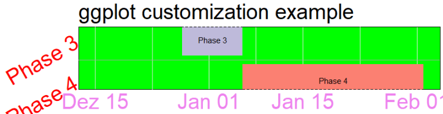


**Remark:** It's similar for `vistime` objects, use `Plotly`'s `layout` function, though not all attributes are changeable there:

```{r}
p <- vistime(data, optimize_y = T, col.group = "event", title = "plotly customization example")
library(plotly)
p %>% layout(yaxis=list(fixedrange=TRUE), title = "A different plot",
             plot_bgcolor = "yellow", xaxis = list(title = "x Axis"), 
             yaxis = list(mirror = FALSE, range = c(0.7, 3.5), showgrid = T))
```

### Using `plotly::plotly_build()` for `vistime` charts

The function `plotly_build()` from package `plotly` turns your plot into a list. You can then use the function `str` to explore the structure of your plot. You can even manipulate all the elements there.

The key is to first create a **simple Plotly example** yourself, turning it into a list (using `plotly_build()`) and **exploring the resulting list** regarding the naming of the relevant attributes. Then manipulate or create them in your vistime example accordingly. Below are some examples of common solutions.

#### Changing x-axis tick font size
The following example creates the presidents example and manipulates the font size of the x axis ticks:

```{r}
pres <- data.frame(Position = rep(c("President", "Vice"), each = 3),
                   Name = c("Washington", rep(c("Adams", "Jefferson"), 2), "Burr"),
                   start = c("1789-03-29", "1797-02-03", "1801-02-03"),
                   end = c("1797-02-03", "1801-02-03", "1809-02-03"),
                   color = c('#cbb69d', '#603913', '#c69c6e'),
                   fontcolor = c("black", "white", "black"))
 
p <- vistime(pres, col.event = "Position", col.group = "Name", title = "Presidents of the USA")

# step 1: transform into a list
library(plotly)
pp <- plotly_build(p)

# step 2: change the font size
pp$x$layout$xaxis$tickfont <- list(size = 28)

pp
```
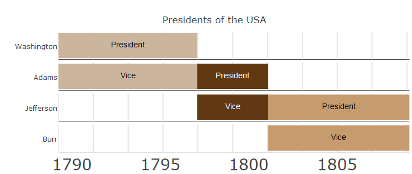

#### Changing y-axis tick font size
We need to change the font size of the y-axis:

```{r}
pp$x$layout[["yaxis"]]$tickfont <- list(size = 28)

pp
```
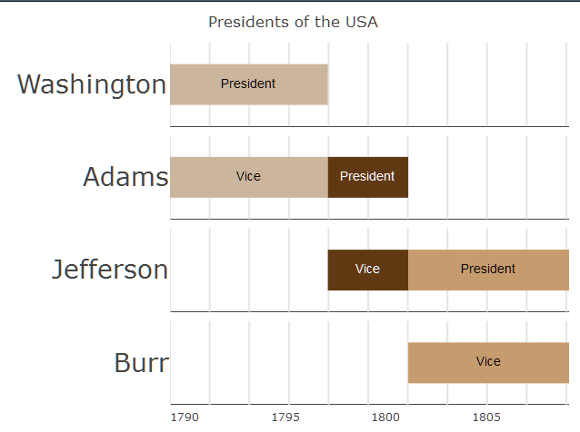

#### Changing events font size
The following example creates the presidents example and manipulates the font size of the events:


```{r}
pres <- data.frame(Position = rep(c("President", "Vice"), each = 3),
                    Name = c("Washington", rep(c("Adams", "Jefferson"), 2), "Burr"),
                    start = c("1789-03-29", "1797-02-03", "1801-02-03"),
                    end = c("1797-02-03", "1801-02-03", "1809-02-03"),
                    color = c('#cbb69d', '#603913', '#c69c6e'),
                    fontcolor = c("black", "white", "black"))
 
p <- vistime(pres, col.event = "Position", col.group = "Name", title = "Presidents of the USA")

# step 1: transform into a list
library(plotly)
pp <- plotly_build(p)

# step 2: loop over pp$x$data, and change the font size of all text elements to 28
for(i in seq_len(length(pp$x$data))){
    if(pp$x$data[[i]]$mode == "text") pp$x$data[[i]]$textfont$size <- 28
}

pp

# or, using purrr:
# text_idx <- which(purrr::map_chr(pp$x$data, "mode") == "text")
# for(i in text_idx) pp$x$data[[i]]$textfont$size <- 28
# pp
```
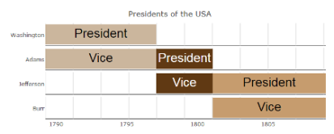

#### Changing marker size
The following example a simple example using markers and manipulates the size of the markers:


```{r}
dat <- data.frame(event = 1:4, start =  c("2019-01-01", "2019-01-10"))
 
p <- vistime(dat)

# step 1: transform into a list
library(plotly)
pp <- plotly_build(p)

# step 2: loop over pp$x$data, and change the marker size of all text elements to 50px
for(i in seq_len(length(pp$x$data)){
    if(pp$x$data[[i]]$mode == "markers") pp$x$data[[i]]$marker$size <- 10
}

pp

# or, using purrr:
# marker_idx <- which(purrr::map_chr(pp$x$data, "mode") == "markers")
# for(i in marker_idx) pp$x$data[[i]]$marker$size <- 10
# pp
```

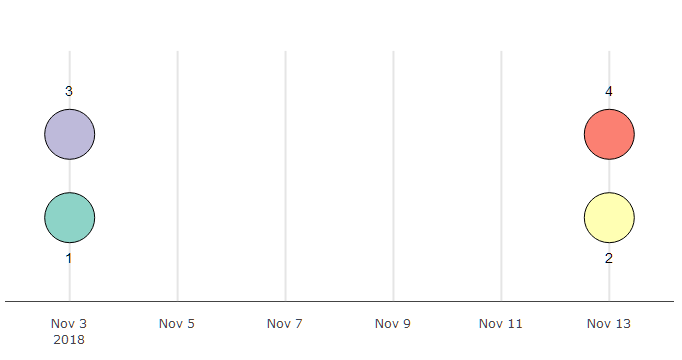

