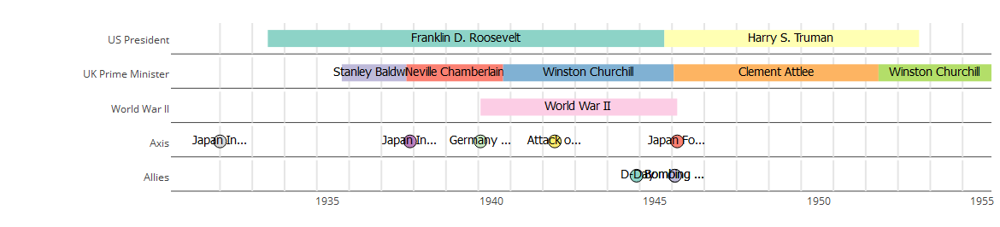

# vistime
an R package for pretty timeline creation

## example 1:
```{r}
dat <- data.frame(Room=c("Room 1","Room 2","Room 3"),
                  Language=c("English", "German", "French"),
                  start=as.POSIXct(c("2014-03-14 14:00",
                                     "2014-03-14 15:00",
                                     "2014-03-14 14:30")),
                  end=as.POSIXct(c("2014-03-14 15:00",
                                   "2014-03-14 16:00",
                                   "2014-03-14 15:30")))
vistime(dat, start="start", end="end", groups="Room", events="Language")
```


## example 2:
```{r}
dataGroups <- data.frame(
  content = c("Open", "Open",
              "Open", "Open", "Half price entry",
              "Staff meeting", "Open", "Adults only", "Open", "Hot tub closes",
              "Siesta"),
  start = c("2016-05-01 07:30:00", "2016-05-01 14:00:00",
            "2016-05-01 06:00:00", "2016-05-01 14:00:00", "2016-05-01 08:00:00",
            "2016-05-01 08:00:00", "2016-05-01 08:30:00", "2016-05-01 14:00:00",
            "2016-05-01 16:00:00", "2016-05-01 19:30:00",
            "2016-05-01 12:00:00"),
  end   = c("2016-05-01 12:00:00", "2016-05-01 20:00:00",
            "2016-05-01 12:00:00", "2016-05-01 22:00:00", "2016-05-01 10:00:00",
            "2016-05-01 08:30:00", "2016-05-01 12:00:00", "2016-05-01 16:00:00",
            "2016-05-01 20:00:00", NA,
            "2016-05-01 14:00:00"),
  group = c(rep("lib", 2), rep("gym", 3), rep("pool", 5), "siesta"))

vistime(dataGroups, start="start", end="end", groups="group", events="content")
```


## example 3:
```{r}
library(timeline)
data(ww2)
ww2.events$EndDate <- ww2.events$Date
ww2.events$StartDate <- ww2.events$Date
names(ww2.events)<-c("Person", "Date", "Group", "EndDate", "StartDate")
ww2.events<- ww2.events[,names(ww2)]
vistime(rbind(ww2, ww2.events), events="Person")
```
